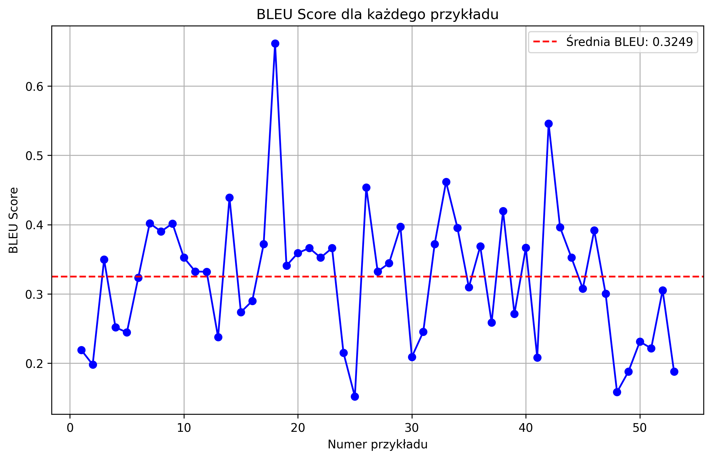
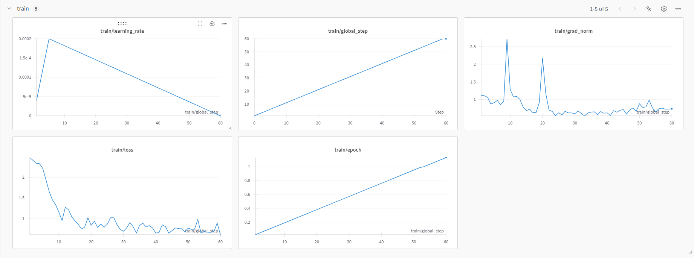

# Generator opisów oraz haseł reklamowych produktów

## Opis projektu
Ten projekt dotyczy przetwarzania danych z pliku CSV zawierającego szczegółowe kategorie produktów. Celem jest stworzenie modelu językowego, który generuje opisy i hasła reklamowe dla produktów w różnych kategoriach. Proces obejmuje podział danych, trening modelu, generowanie wyników oraz ocenę jakości opisu na podstawie metryk takich jak BLEU.

---


## Struktura projektu

### Pliki

- **`amazon_products_with_detailed_categories.csv`** - Plik CSV zawierający dane produktów.
- **`split_data.py`** - Skrypt do podziału danych na zbiory treningowy i testowy.
- **`train.py`** - Skrypt do trenowania modelu językowego z wykorzystaniem frameworka `unsloth`.
- **`model_utils.py`** - Funkcje pomocnicze do ładowania modelu i konfiguracji fine-tuningu (Lora).
- **`inference.py`** - Skrypt do generowania opisów i reklam na podstawie podanego produktu i kategorii.
- **`evaluate.py`** - Skrypt do oceny jakości generowanych opisów na podstawie metryki BLEU.
- **`data_preprocessing.py`** - Skrypt do przygotowywania danych wejściowych w odpowiednim formacie do trenowania modelu.
- **`bleu_score_plot.png`** - Wykres przedstawiający BLEU score dla przykładów testowych.
- **`train_metrics.png`** - Wykres przedstawiający metryki treningowe.

---

## Zbiór danych

- **Źródło danych:** Plik CSV zawiera szczegółowe informacje o produktach, takie jak kategorie, nazwy produktów, opisy oraz istniejące teksty reklamowe.
- **Charakterystyka:**
  - Liczba rekordów: **[527]**
  - Format danych: CSV z kolumnami `category`, `product`, `description`, `ad`.
  - Pozyskanie danych: **[90 rekordów wzięte z datasetu : [https://huggingface.co/datasets/FourthBrainGenAI/Product-Descriptions-and-Ads], reszta po przez ręczne wprowadzenie 436 rekordów]**.

- **Podział danych:**
  - Dane zostały podzielone w stosunku 80:20 na zbiór treningowy i testowy.

- **Przetwarzanie wstępne:**
  - Formatowanie promptów do treningu w stylu `Instruction`, `Input` i `Response`.
---

## Model i architektura

- **Model bazowy:** `unsloth/Llama-3.2-3B`
- **Architektura:** Transformer z mechanizmem Lora (Low-Rank Adaptation).
- **Modyfikacje:**
  - Zastosowanie PEFT (Parameter-Efficient Fine-Tuning) do dostrojenia modelu.
  - Wykorzystanie gradient checkpointing w celu zmniejszenia użycia pamięci.

---

## Metodologia

1. **Przetwarzanie wstępne:**
   - Ładowanie danych z pliku CSV
   - Formatowanie promptów zgodnie z wymogami treningu.
2. **Trening modelu:**
   - Fine-tuning modelu Llama-3.2-3B przy użyciu frameworka `unsloth`.
   - Parametry treningu:
     - Batch size: 2
     - Learning rate: 2e-4
     - Gradient accumulation steps: 4
     - Maksymalna długość sekwencji: 2048 tokenów
3. **Ewaluacja:**
   - Generowanie wyników dla zbioru testowego.
   - Obliczenie BLEU score dla każdego przykładu.
4. **Inference:**
   - Generowanie opisów i haseł reklamowych dla użytkownika w czasie rzeczywistym.

---

## Wyniki

### BLEU Score



#### Analiza wyników
- Wykres przedstawia BLEU score dla każdego przykładu testowego.
- **Średnia wartość BLEU:** 0,3249.
- Linia przerywana na wykresie reprezentuje średnią wartość BLEU, co pozwala szybko zidentyfikować przykłady o niższej jakości.

### Metryki treningowe



---

## Narzędzia i środowisko

### Biblioteki:
- `transformers`
- `torch`
- `unsloth`
- `pandas`
- `datasets`
- `matplotlib`
- `nltk`

### Środowisko programowe:
- Python 3.11.11
- Poetry jako narzędzie zarządzania zależnościami.

---

## Instrukcja użytkowania

### 1. Przygotowanie danych
Podziel dane na zbiory treningowy i testowy za pomocą `split_data.py`. Plik CSV z danymi powinien znajdować się w folderze `data`.

```bash
python split_data.py
```

Wyniki:
- `data/train_products.csv`
- `data/test_products.csv`

### 2. Trenowanie modelu
Uruchom `train.py`, aby przeprowadzić fine-tuning modelu bazowego na dostosowanym zbiorze danych.

```bash
python train.py
```
Wynikowy model zostanie zapisany w folderze `fine-tuned-ad`.

### 3. Generowanie opisów i reklam
Użyj `inference.py` do generowania opisów i reklam na podstawie podanej kategorii oraz produktu.

```bash
python inference.py
```
Wybierz kategorię z listy, a następnie wprowadź nazwę produktu. Model wygeneruje opis i hasło reklamowe.

### 4. Ocena wyników
Użyj `evaluate.py` do oceny jakości generowanych opisów. Skrypt oblicza BLEU score dla każdego przykładu testowego i generuje wykres wyników.

```bash
python evaluate.py
```

Wynikowy wykres zostanie zapisany jako `bleu_score_plot.png`.

---

